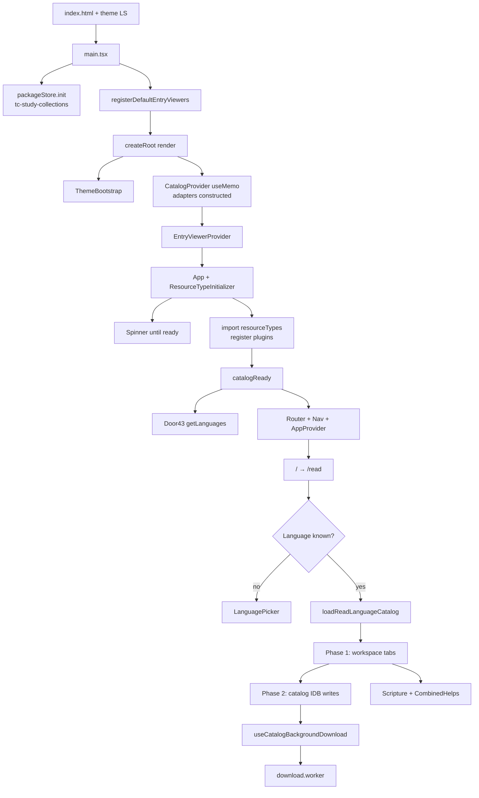
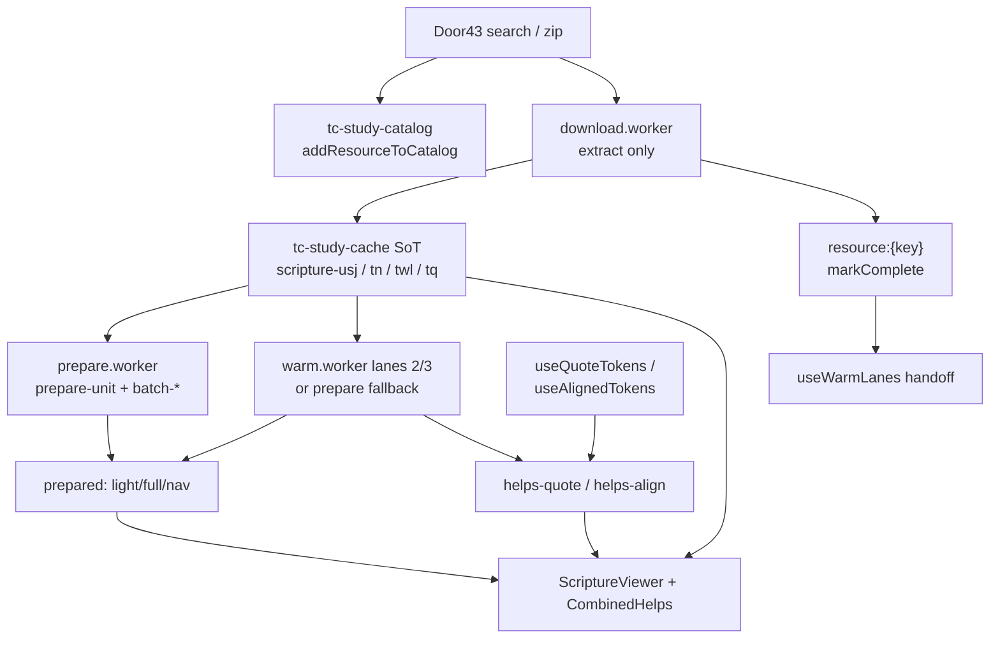

# App lifecycle and data flow (tc-study)

Process start → first paint → IndexedDB writes. This is the **current boot order**, read from the files named below — not a proposal.

Companions: [workers-and-persistence.md](./workers-and-persistence.md) (key families, worker message types, lanes) · [helps-quote-flow.md](./helps-quote-flow.md) (TN/TWL chips without ScriptureViewer). Interactive map: open the Cursor canvas `tc-study-lifecycle-data-flow.canvas.tsx` beside chat.

---

## Boot order (actual files)

Numbered as the browser executes them. “Constructs” ≠ “opens IndexedDB.”

1. `apps/tc-study/index.html` — `#root`, Vite module `/src/main.tsx`. Inline script reads `localStorage['tc-study:theme-preference']` and sets `document.documentElement` dark/light **before JS**.
2. `src/main.tsx` module graph evaluates. Import of `src/App.tsx` pulls `workspaceStore` → `workspacePackageSlice` → `src/lib/stores/packageStore.ts`. That file’s module body calls `initialize()` when `indexedDB` exists, opening **`tc-study-collections` / `packages`** (eager, before React render).
3. Still in `main.tsx`: `registerDefaultEntryViewers(entryViewerRegistry)` (sync).
4. `ReactDOM.createRoot(#root).render` — `StrictMode` in DEV only.
5. `src/features/theme/ThemeBootstrap.tsx` — listens for OS theme changes (preference already applied).
6. `src/contexts/CatalogContext.tsx` `CatalogProvider` first render `useMemo`:
   - `new IndexedDBCacheAdapter({ dbName: 'tc-study-cache', storeName: 'cache-entries', version: 1 })`
   - `new IndexedDBCatalogAdapter({ dbName: 'tc-study-catalog', storeName: 'catalog-entries', version: 1 })`
   - `getDoor43ApiClient()` singleton
   - `CatalogManager`, `ViewerRegistry`, `LoaderRegistry`, `ResourceTypeRegistry`, panel registries
   - `ResourceLoadingService`, `ResourceCompletenessChecker`, `BackgroundDownloadManager`
   - **Constructors do not call `indexedDB.open`.** Both adapters open lazily in `initDB()` on first `get` / `set` / `keys`.
7. `useEffect` in `CatalogProvider` sets `servicesReady`. `ready` stays false until types register.
8. `src/contexts/EntryViewerContext.tsx` wraps `App`.
9. `src/App.tsx` mounts `ResourceTypeInitializer` **outside** the ready gate (so types can become ready). Until `catalogReady`, the tree is a spinner — **no Router**.
10. `src/components/ResourceTypeInitializer.tsx` `useEffect`: dynamic `import('../resourceTypes')`, register resource types / panel groups / modes / entries, `reensureCurrentWorkspaceCompositions()`, `markResourceTypesReady()`.
11. `catalogReady = servicesReady && resourceTypesReady`. Comment in `App.tsx`: this is **not** “catalog downloaded.”
12. `App.tsx` `useEffect` (after ready): `getDoor43ApiClient().getLanguages({ stage: 'prod' })` → wizard `setAvailableLanguages`. If path is **not** `/read/:lang…`, `workspaceStore.loadSavedWorkspace()` (localStorage `tc-study-workspace`). Deep-link `/read/:lang` skips workspace restore; Read owns bootstrap.
13. `BrowserRouter` → `NavigationProvider` (`src/contexts/NavigationContext.tsx` + `features/nav/navigationStore.ts`, hydrated from `localStorage['bt-synergy:navigation-state']`, default BCV `tit 1:1`) → `AppProvider` (`src/contexts/AppContext.tsx`, in-memory `loadedResources`).
14. `src/components/Layout.tsx` — Read hides the app bar. `/` redirects to `/read`.
15. `src/pages/Read.tsx` → `src/components/read/SimplifiedReadView.tsx`.
16. `src/features/read/useReadLanguageBootstrap.ts`:
    - `useReadCatalogLoad` (flags + `loadReadLanguageCatalog`)
    - `useEnsureCurrentBookOriginalLanguage` — `catalogAdapter.get` for UGNT/UHB (this can be the **first `tc-study-catalog` open**)
    - `useBackgroundDownload({ autoStart: false })` — session singleton, **no worker yet**
    - `useCatalogBackgroundDownload` — always armed (`enabled: !DISABLE_BACKGROUND_DOWNLOAD`); completeness uses stamped ingest receipts when present so matching releases skip zip + ingredient walks
    - `useReadUrlLanguageHydrate` — URL or persisted panel language → `handleLanguageSelected`
17. Empty first visit (`/read`, no `tc-study:read-panels` language): `needsReadLanguagePicker` → header `LanguagePicker`. No Door43 catalog search, no download worker, **`tc-study-cache` typically still closed**.
18. Language selected (picker or hydrate): `handleLanguageSelected` → `coldStartCatalogLoads` → `runCatalogLoad` → `src/features/read/loadReadLanguageCatalog.ts`.
19. After Phase 1 membership + `loadedResources`, the download monitor runs (500ms schedule). It checks stamped ingest receipts first (O(1) skip when release+schema match); otherwise `checkResource` walks ingredients. Incomplete keys call `backgroundDownloadSession.startDownload` (constructs `backgroundDownload.worker.ts`). Catalog `getAll` / completeness timeouts are treated as unknown — not false-incomplete enqueue.
20. Scripture tab paints → `ScriptureViewer` → `useContent` → `readPreparedNav` / `loadUsjViewModel` → `enqueueScriptureBookPriority` (`prepare.worker.ts`).
21. CombinedHelps mounts → `useCombinedHelpsPipeline` (`useQuoteTokens`, `useAlignedTokens`) + `useWarmLanes`. Lanes 2/3 admit only after both scripture and helps report lane-1 drained.

Zustand / localStorage that hydrate **without** IndexedDB:

| Key | File | When |
| --- | --- | --- |
| `tc-study:theme-preference` | `index.html`, `themeStore.ts` | Before first paint |
| `bt-synergy:navigation-state` | `navigationPersistence.ts` | `navigationStore` module init |
| `tc-study:read-panels` | `readPanelPersistence.ts` | `readPanelStore` module init |
| `tc-study-workspace` | `workspacePersistence.ts` | `workspaceStore` module init; `loadSavedWorkspace` after ready (skipped on `/read/:lang`) |
| `tc-study:languages-cache` | `languagesCache.ts` | Read on catalog-load planning; written when the picker list is saved |

---

## Boot sequence

---

## Write pipeline

Prepare **never** runs inside the download worker. After zip, `resource-complete` → session `completedResourceKeys` → `useWarmLanes` reseeds. Lane 2/3 wait for `canAdmitBackgroundLanes` (lane-1 drained, scroll settled, tab visible).

---

## What is written when

### 1. Empty first visit (no IDB, no persisted language)

| When | Storage | What |
| --- | --- | --- |
| HTML parse | localStorage **read** | Theme preference (miss → system) |
| `App` import | **`tc-study-collections` open** | `packageStore.initialize()` — empty `packages` store |
| CatalogProvider | none | Adapters exist; cache + catalog DBs **not** opened |
| Types ready | none | First paint: Read chrome + language picker |
| Read mount | **`tc-study-catalog` may open** | `useEnsureCurrentBookOriginalLanguage` → `catalogAdapter.get(UGNT/UHB)` (miss). Default book is `tit` from nav store. |
| Still no language | **`tc-study-cache` usually still closed** | Download monitor `enabled=false`; no `useContent` |

No `scripture-usj:`, `prepared:`, or `helps-quote:` yet.

### 2. Return visit (hydrate)

| When | Storage | What |
| --- | --- | --- |
| Module init | localStorage | Theme, nav BCV, read-panel languages, workspace package |
| Ready + `/read` without `:lang` | localStorage | `loadSavedWorkspace()` unless path is `/read/:lang…` |
| URL/cache language | memory + catalog load | `useReadUrlLanguageHydrate` → `handleLanguageSelected` (same path as a fresh pick) |
| Phase 2 | `tc-study-catalog` | `addResourceToCatalog` overwrites metadata rows (Door43 still searched) |
| Completeness | `tc-study-cache` **read** | `resource:{key}` with `downloadComplete` → skip zip |
| `useContent` | cache **read** | `prepared:scripture:…:nav` hit → paint chrome, enqueue open+adjacent only (`includeRest: false`) |
| Quotes / align | cache **read** | `helps-quote:` / `helps-align:` cache-first; worker only on misses |

Workers are **not** restored. Queues start empty. Warm reseeds from downloaded keys + coverage.

### 3. Language / resource selected

`handleLanguageSelected` (`useReadLanguageBootstrap.ts`):

1. Seed / set panel languages (`tc-study:read-panels`).
2. `loadReadLanguageCatalog`:
   - Door43 `searchCatalogHitsForTarget` (network).
   - **Phase 1** `hydrateReadCatalogHits` — workspace + `loadedResources` (localStorage workspace persist, `autoSaveWorkspace`). CombinedHelps injected via `applyCombinedHelpsEnsure`.
   - **Phase 2** (fire-and-forget `Promise.allSettled`): `createResourceMetadata` + `catalogManager.addResourceToCatalog` → **first catalog writes**. Then narrow `expectedResources` via `getAllResourceKeys`, save `{lang}_tc-helps` into **`tc-study-collections`**.
3. `useEnsureCurrentBookOriginalLanguage` adds UGNT/UHB to expected if the catalog row exists.

Download does **not** start in this function. It starts when the monitor sees `loadedResources.length > 0`, catalog load flags clear, and every expected key is already in the catalog DB.

### 4. Chapter open

`ScriptureViewer/hooks/useContent.ts`:

1. Poll `catalogManager.getResourceMetadata` (250 ms, 12 tries) until Phase 2 lands.
2. `readPreparedNav` from **main-thread** `cacheAdapter`.
3. **Nav hit:** paint nav, `enqueueScriptureBookPriority({ includeRest: false })`, defer `loadUsjViewModel` on idle.
4. **Nav miss:** `loadUsjViewModel` immediately (loader reads `scripture-usj:` or network-heals), then same enqueue.
5. Chapter change: enqueue again with `includeRest: false` (rest of book is lane 2).
6. `useWarmLanes({ owner: 'scripture' })` — lane 1 ready when not loading, viewModel present, and open chapter has USJ verses or prepared **full** in the memory peek.

`prepare.worker` is constructed on first `enqueue` (`prepareClient.ts` `getWorker()`).

### 5. Background download + per-resource handoff

`useCatalogBackgroundDownload` → `backgroundDownloadSession.startDownload` → `new Worker(backgroundDownload.worker.ts)`.

Worker constructs **its own** adapters (same db/store names), `downloadResource`, then `completenessChecker.markComplete` → `resource:{key}`, then `postMessage resource-complete`.

Main thread: session `completedResourceKeys` → `useWarmLanes` `handoffKeys` + `downloadTick` → scheduler reseeds. Badge = zip % only.

`ensureOriginalLanguageDownload` can start a one-key zip when the session is idle if UGNT/UHB is missing (quote dependency).

### 6. Warm fill

`CombinedHelpsViewer` + `useContent` both call `useWarmLanes` (owners `helps` / `scripture`). Scheduler waits until **both** drain lane 1.

Lane 2/3: `warm.worker.ts` if `hardwareConcurrency >= 4`, else `warm-job` on prepare.worker. Writes `prepared:`, `helps-quote:`, `helps-align:`, `warm-coverage:v1`. Outcomes `blocked` / `noop` do not mark coverage.

### 7. Quote / align persist

Lane 1 (visible chapter), not the download worker:

- `useQuoteTokens` — `readCachedQuoteTokensForSpan` then `mergeAndWriteCachedQuoteTokens` (`helps-quote:`, TTL 30 days).
- `useAlignedTokens` — `readCachedAlignmentsForSpan` then `persistAlignResults` (`helps-align:`). Reconstruct `p[]` against `prepared:scripture` **full** only.

Highlight replay (`persistHelpsHighlight`) is **module memory**, not IDB. Tab close drops it.

### 8. Tab close

Workers terminate. Session / scheduler / in-memory highlight maps die. IndexedDB (`tc-study-cache`, `tc-study-catalog`, `tc-study-collections`) and localStorage keys remain. Next visit is scenario 2.

---

## When each IndexedDB opens

| Database | First open (typical) | First write (typical) |
| --- | --- | --- |
| `tc-study-collections` | `packageStore.initialize()` during `App` import (before first React commit) | `{lang}_tc-helps` after Phase 2 metadata, or user save |
| `tc-study-catalog` | Read mount: OL `catalogAdapter.get`, or Phase 2 `set`, or `useContent` metadata poll | Phase 2 `addResourceToCatalog` |
| `tc-study-cache` | Completeness `checkResource` **or** `useContent` `readPreparedNav` (race) | Download worker SoT + `resource:{key}`; later prepare/quote/align |

**Uncertainty:** cache vs catalog **first open** is not a single guaranteed order. Adapters are constructed together (cache object first in the `useMemo`), but `indexedDB.open` is lazy. On a picker-only first visit, catalog often opens first (OL get) and cache stays closed. After a language pick, Phase 2 catalog writes and `useContent` / completeness cache reads overlap — either DB can complete `open` first. Collections usually starts **before** both, because `packageStore` initializes at import time.

Workers each call `indexedDB.open` again on the same names (separate connections, same DBs).

---

## File map (lifecycle)

| Step | Files |
| --- | --- |
| HTML / entry | `index.html`, `src/main.tsx` |
| Providers | `CatalogContext.tsx`, `App.tsx`, `ResourceTypeInitializer.tsx`, `NavigationContext.tsx`, `AppContext.tsx` |
| Read bootstrap | `pages/Read.tsx`, `SimplifiedReadView.tsx`, `useReadLanguageBootstrap.ts`, `useReadUrlLanguageHydrate.ts`, `useReadCatalogLoad.ts`, `loadReadLanguageCatalog.ts` |
| Catalog writes | `hydrateReadCatalogMetadata.ts`, `hydrateOriginalLanguageResources.ts` |
| Download | `useCatalogBackgroundDownload.ts`, `backgroundDownloadSession.ts`, `backgroundDownload.worker.ts` |
| Scripture | `ScriptureViewer/hooks/useContent.ts`, `prepareClient.ts`, `prepare.worker.ts` |
| Helps / warm | `CombinedHelpsViewer/index.tsx`, `useCombinedHelpsPipeline.ts`, `useQuoteTokens.ts`, `useAlignedTokens.ts`, `useWarmLanes.ts` |
