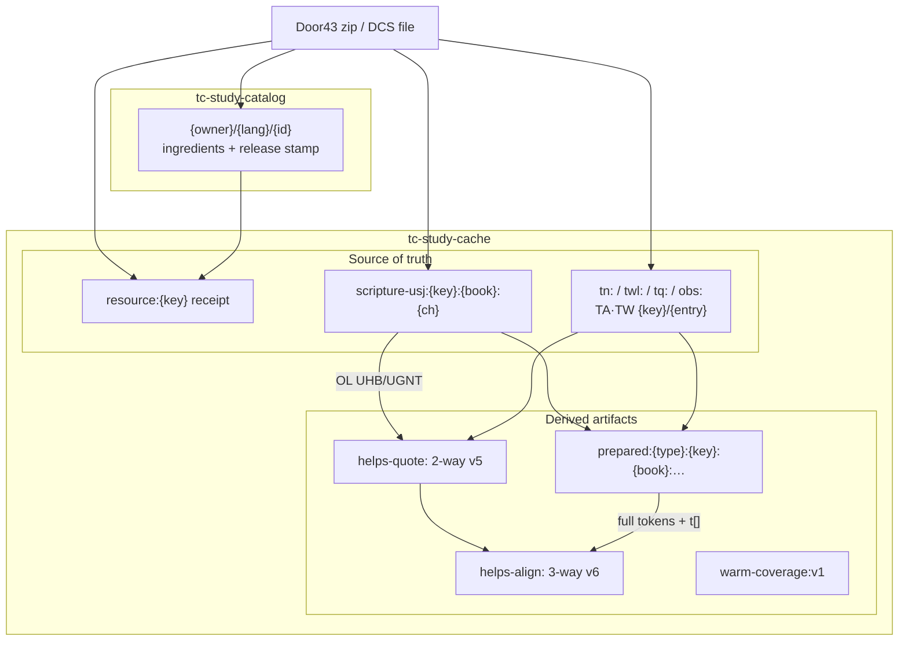

# Cache data structure (tc-study)

Physical IndexedDB layout: databases, key families, source-of-truth vs derived artifacts, version gates, and what a language-pack zip would carry.

This is the current code, not a proposal. Key prefixes and versions come from the cache modules, loaders, and `config/resourceArtifactRecipe.ts`.

**Workers / lanes / download badge:** [workers-and-persistence.md](./workers-and-persistence.md). **TN/TWL chips:** [helps-quote-flow.md](./helps-quote-flow.md). **When each DB opens:** [app-lifecycle-data-flow.md](./app-lifecycle-data-flow.md).

---

## 1. Databases

| Database | Object store | Version | Adapter | Purpose |
| --- | --- | --- | --- | --- |
| `tc-study-cache` | `cache-entries` | 1 | `IndexedDBCacheAdapter` | Language-cache SoT + receipts + derived artifacts |
| `tc-study-catalog` | `catalog-entries` | 1 | `IndexedDBCatalogAdapter` | Resource **metadata** only (titles, ingredients, `release.tag_name` / `published_at`) |
| `tc-study-collections` | `packages` | — | `packageStore` | Workspace / collection packages (`{lang}_tc-helps`). Not content. |

Catalog rows are keyed by `{owner}/{language}/{id}` (e.g. `unfoldingWord/en/ult`). The row is `{ key, metadata }`. Do not look for titles or ingredients inside `tc-study-cache`.

`IndexedDBCacheAdapter` default name is `resource-cache`. tc-study always constructs `tc-study-cache` (CatalogProvider, download / prepare / warm workers, Read export).

**Old name:** `bt-synergy-cache` still appears on **collection** export/import (`CollectionExportDialog`, `SaveCollectionDialog`, `useCollectionImport`). Those dialogs open a different DB than the live language cache. A language-pack zip must read **`tc-study-cache` + `tc-study-catalog`**, not `bt-synergy-cache`.

localStorage (`tc-study:languages-cache`, `tc-study:read-panels`, …) is session chrome, not this SoT.

### Adapter chunking vs first-class chapter keys

`BOOK_ORGANIZED_PREFIXES` = `scripture:` (legacy), `scripture-usj:`, `tn:`, `tq:`. The adapter may split a **logical book blob** into a manifest + `{book}:{ch}` (+ `{book}:{ch}:alignments` for scripture). `twl:`, `prepared:`, `helps-quote:`, `helps-align:`, `helps-text:`, `obs:`, and `resource:` are **one IDB row per key**.

New scripture writes skip the blob path: each chapter is already one get at `scripture-usj:{key}:{book}:{ch}`. The book key is a thin `{ chapterNumbers }` index. Legacy whole-book USJ blobs still migrate on first chapter read.

---

## 2. Source vs artifact

Recipes live in `src/config/resourceArtifactRecipe.ts`. They declare SoT grain and which artifacts to build. They do not download zips.

| Layer | Prefixes | Required to rehydrate? | Rebuild? |
| --- | --- | --- | --- |
| **Catalog** | catalog DB key = resource key | Yes (stamps, ingredients) | Door43 search / Phase 2 |
| **Receipt** | `resource:{owner}/{lang}/{id}` | Yes (skip zip + walk) | After a full extract (`markComplete`) |
| **SoT** | `scripture-usj:`, `tn:`, `twl:`, `tq:`, `obs:`, `{key}/{entryId}` | **Yes** | Download worker / DCS hydrate (`getSoT` + `fetchDcsSoT`) |
| **Prepared** | `prepared:{type}:{key}:{book}:nav\|{unit}:{light\|full}` | No | `prepare.worker` / warm `prepare-unit` / `prepare-article` |
| **Quote** | `helps-quote:` | No | warm `quote-chapter` / lane-1 `useQuoteTokens` — needs **OL SoT** |
| **Align** | `helps-align:` | No | warm `align-chapter` / `useAlignedTokens` — needs quote + **prepared full** target |
| **Chrome** | `helps-text:`, `warm-coverage:v1` | No | Title cache / lane-3 skip index |

Download worker writes SoT + receipts only. Prepare/warm write artifacts. Version mismatch or TTL expiry is a miss; SoT is enough to rebuild.



---

## 3. Key conventions

Resource keys are `{owner}/{language}/{id}`. Stamps come from catalog metadata (`release.tag_name` + `published_at`, else `version`, else `nostamp`). Separators `:` `|` `@` in stamp parts become `_`.

- **OL stamp** (quote/align): `{resourceContentStamp}+{USJ_PROCESSING_VERSION}` → e.g. `v1+2.2.0-usj`.
- **Target-scripture stamp** (align): `{resourceContentStamp}+{SCRIPTURE_PREPARE_VERSION}` → e.g. `v1+3000220` (schema `3` + USJ digits `220`).

Prepared / quote / align / coverage use envelope `{ content, timestamp, version }`. Quote and align also set `expiresAt`. A version mismatch is a miss.

### Catalog metadata

```
unfoldingWord/en/ult
unfoldingWord/en/tn
unfoldingWord/el-x-koine/ugnt
```

Value: `ResourceMetadata` (type, subject, ingredients, `release.tag_name`, `published_at`, version). Used to compute stamps and `ingestSchema`.

### Receipts — `resource:{owner}/{lang}/{id}`

```
resource:unfoldingWord/en/ult
resource:unfoldingWord/hbo/uhb
```

Means “this Door43 release was fully ingested into SoT,” not that a zip blob is on disk. Matching `releaseStamp` + `ingestSchema` skips zip fetch and ingredient walks. Stamp mismatch or USJ schema bump invalidates. Legacy unstamped `downloadComplete` still walks once.

`absentFromRelease` lists catalog ingredients that are not in the zip (phantoms such as `num` / `frt`). Completeness walks exclude them; `ingredientCount` is the **present** count.

### Scripture SoT — `scripture-usj:`

```
scripture-usj:unfoldingWord/en/ult:tit          → thin index { chapterNumbers }
scripture-usj:unfoldingWord/en/ult:tit:1        → chapter USJ + alignmentMap
scripture-usj:unfoldingWord/en/ult:tit:1:alignments   → legacy book-blob split only
```

New writes: one IDB get per chapter (`usj` + `alignmentMap` + one `chapters[]` slice). Book key lists `chapterNumbers` without USJ. Gated by `USJ_PROCESSING_VERSION` + `USJ_TOOL_VERSIONS`.

### Helps SoT — `tn:` / `twl:` / `tq:`

```
tn:unfoldingWord/en/tn:tit     → notesByChapter (adapter-chunked)
twl:unfoldingWord/en/twl:tit   → linksByChapter (whole-book row)
tq:unfoldingWord/en/tq:tit     → questionsByChapter (adapter-chunked)
```

`tn:` / `tq:` are in `BOOK_ORGANIZED_PREFIXES` (manifest + `{book}:{ch}`). `twl:` is **not** — one row per book. Completeness is `resource:…`, not these keys. TN TSV parse is `NOTES_TSV_PARSER_VERSION` (`2`); prepared notes v4 rebuilds from current `tn:` blobs.

OBS notes / questions / words-links reuse the same prefixes with OBS resource keys.

### Articles — TA / TW + `helps-text:`

```
unfoldingWord/en/ta/translate/figs-metaphor
unfoldingWord/en/tw/bible/kt/god
helps-text:ta-title:unfoldingWord/en/ta@v45#pub:translate/figs-metaphor
helps-text:tw-title:unfoldingWord/en/tw@v1:kt/god
helps-text:tw-preview:unfoldingWord/en/tw@v1:kt/grace
```

Article SoT is `{resourceKey}/{entryId}` (no type prefix). `helps-text:` is stamp-swept chrome (`HELPS_TEXT_VERSION` 1), not book-chunked.

### OBS SoT

```
obs:unfoldingWord/en/obs:01
obs:unfoldingWord/en/obs:50
```

Stories `01..50`. Completeness must see all 50 story keys (or a matching receipt).

### Prepared

```
prepared:{typeId}:{resourceKey}:{book}:nav
prepared:{typeId}:{resourceKey}:{book}:{unit}:{light|full}
```

Examples:

```
prepared:scripture:unfoldingWord/en/ult:tit:nav
prepared:scripture:unfoldingWord/en/ult:tit:1:light
prepared:scripture:unfoldingWord/en/ult:tit:1:full
prepared:notes:unfoldingWord/en/tn:tit:1:full
prepared:words-links:unfoldingWord/en/twl:tit:1:full
prepared:questions:unfoldingWord/en/tq:tit:1:full
```

OBS units are story numbers. TA/TW use `prepare-article`. Reconstruct align `p[]` against `prepared:scripture` **full** only — never light or live USJ.

### `helps-quote:` v5 — 2-way (helps × OL)

```
helps-quote:{helps}@{hs}:{ol}@{os}:{book}:{ch}
```

```
helps-quote:unfoldingWord/en/tn@v45:unfoldingWord/el-x-koine/ugnt@v1+2.2.0-usj:tit:1
```

Value: `Record<linkId, CachedQuoteToken[]>`. Empty array = settled miss. Tokens may carry `chapter` / `verse` so multi-verse TN hits paint every listed verse. TTL **30 days**.

### `helps-align:` v6 — 3-way (helps × OL × target)

```
helps-align:{helps}@{hs}:{ol}@{os}:{target}@{ts}:{book}:{ch}
```

```
helps-align:unfoldingWord/en/tn@v45:unfoldingWord/el-x-koine/ugnt@v1+2.2.0-usj:unfoldingWord/en/ult@v1+3000220:tit:1
```

Value: `Record<linkId, { p: number[]; m: 0|1|2; t?: string[] }>`. `m`: 0 miss, 1 semantic/zaln, 2 quote-text fallback. `p` = word positions in prepared **full**. `t` = display texts so chips paint on refresh before tokens. TTL **30 days**. One row **per target** scripture.

### `warm-coverage:v1`

Single key. Map of **relation ids** (not IDB keys):

```
prep:scripture:unfoldingWord/en/ult:tit
quote:unfoldingWord/en/tn|unfoldingWord/el-x-koine/ugnt|tit
align:unfoldingWord/en/tn|unfoldingWord/el-x-koine/ugnt|unfoldingWord/en/ult|tit
```

Value: `{ stamp, unitCount, updatedAt }`. Lane 3 uses this to skip a finished relation. `blocked` / `noop` do not write coverage.

---

## 4. Version gates

| Gate | Current | Invalidates |
| --- | --- | --- |
| `USJ_PROCESSING_VERSION` / `USJ_TOOL_VERSIONS` | `2.2.0-usj` / parser+usjCore `0.1.1` | `scripture-usj:` chapter SoT; scripture `ingestSchema` (`usj:2.2.0-usj`) |
| `HELPS_INGEST_SCHEMA` | `1` → receipt `helps:1` | Helps / article / OBS receipts |
| `SCRIPTURE_PREPARE_SCHEMA` | `3` | Light/full/nav **shape**. Combined version = `schema * 1_000_000 + USJ digits` → **`3000220`** |
| `NOTES_PREPARE_VERSION` | `4` | `prepared:notes:` |
| `WORDS_LINKS_PREPARE_VERSION` | `1` | `prepared:words-links:` |
| `QUESTIONS_PREPARE_VERSION` / `OBS_PREPARE_VERSION` / `OBS_NOTES_PREPARE_VERSION` | `1` | Matching `prepared:` rows |
| `HELPS_QUOTE_VERSION` | `5` | Quote rows (verse stamps on tokens) |
| `HELPS_ALIGN_VERSION` | `6` | Align rows (keeps quote verse stamps; `t[]` chips) |
| `HELPS_TEXT_VERSION` | `1` | Title / preview strings |
| `WARM_COVERAGE_VERSION` | `1` | Coverage map envelope |
| Quote / align TTL | **30 days** (`expiresAt`) | Abandoned book/chapter combos; stamps still handle correctness |
| `NOTES_TSV_PARSER_VERSION` | `2` | `tn:` parse (raw `Reference`); not an IDB envelope |

`runWarmGc` (idle after lane 3): prune expired quote/align; drop stamp-mismatched quote/align + coverage; if quota **> 60%**, drop other-target align, other-language quote/align, then non-current-book quotes. Prepared rows are not stamp-GC’d — they die on prepare version bumps.

---

## 5. Abbreviated payloads

Wrappers below are what `cache.set` stores. Some SoT rows also carry adapter `type` / `cachedAt`.

### Receipt

```json
{
  "type": "json",
  "content": {},
  "cachedAt": "2026-09-20T00:00:00.000Z",
  "metadata": {
    "downloadComplete": true,
    "downloadCompletedAt": "2026-09-20T00:00:00.000Z",
    "releaseStamp": "v45#2024-01-01T00_00_00Z",
    "ingestSchema": "usj:2.2.0-usj",
    "ingredientCount": 27,
    "downloadMethod": "zip",
    "absentFromRelease": ["num"]
  }
}
```

Helps receipts use `ingestSchema: "helps:1"`.

### Scripture chapter SoT

Key: `scripture-usj:unfoldingWord/en/ult:tit:1`

```json
{
  "content": {
    "book": "Titus",
    "bookCode": "tit",
    "metadata": {
      "version": "2.2.0-usj",
      "toolVersions": { "parser": "0.1.1", "usjCore": "0.1.1" },
      "processingDate": "2026-09-20T00:00:00.000Z",
      "bookCode": "tit",
      "bookName": "Titus"
    },
    "usj": { "type": "USJ", "version": "3.0", "content": [{ "type": "para", "marker": "p" }] },
    "alignmentMap": { "TIT 1:1": [] },
    "chapters": [{ "number": 1, "content": [{ "type": "para", "marker": "p" }] }]
  },
  "timestamp": 1774300000000
}
```

Book index at `scripture-usj:…:tit` is `{ book, bookCode, metadata, chapterNumbers: [1, 2, 3] }` — no `usj`.

### Prepared scripture full

Key: `prepared:scripture:unfoldingWord/en/ult:tit:1:full`  
Envelope version = `SCRIPTURE_PREPARE_VERSION` (`3000220`).

```json
{
  "content": {
    "version": 3000220,
    "unit": 1,
    "matchKeys": ["tit 1:1|paul|1"],
    "blocks": [{
      "marker": "p",
      "role": "paragraph",
      "indentLevel": 0,
      "chapterNumber": 1,
      "verseNumbers": [1],
      "inline": [
        { "kind": "verse", "chapterNumber": 1, "verseNumber": 1 },
        { "kind": "token", "token": { "c": "Paul", "o": 1, "k": 0, "a": [1] } }
      ]
    }]
  },
  "timestamp": 1774300000000,
  "version": 3000220
}
```

Light drops `matchKeys` / token identity (`kind: "text"` only). Nav is `{ version, bookId, bookName, chapters: [{ number, verseCount }] }`.

### Quote row (v5)

Key: `helps-quote:unfoldingWord/en/tn@v45:unfoldingWord/el-x-koine/ugnt@v1+2.2.0-usj:tit:1`

```json
{
  "content": {
    "tn-tit-1-1": [
      { "id": 12, "text": "Παῦλος", "type": "word", "occurrence": 1, "content": "Παῦλος", "chapter": 1, "verse": 1 }
    ],
    "tn-tit-1-9": []
  },
  "timestamp": 1774300000000,
  "version": 5,
  "expiresAt": "2026-10-20T00:00:00.000Z"
}
```

### Align row (v6)

Key: `helps-align:…ugnt@v1+2.2.0-usj:unfoldingWord/en/ult@v1+3000220:tit:1`

```json
{
  "content": {
    "tn-tit-1-1": { "p": [0], "m": 1, "t": ["Paul"] },
    "tn-tit-1-9": { "p": [], "m": 0 }
  },
  "timestamp": 1774300000000,
  "version": 6,
  "expiresAt": "2026-10-20T00:00:00.000Z"
}
```

---

## 6. Language-pack zip

Existing **collection** export (`CollectionExportService`) writes `manifest.json` + `metadata/*.json` + optional `content/` keys whose string **includes** a workspace resource key. It is not a language pack: it can miss `helps-quote:` / `helps-align:` (stamps, `@`), OL keys not in the collection, and it may still open `bt-synergy-cache`.

A **language pack** for `{lang}` (e.g. `en`) should treat `tc-study-cache` + `tc-study-catalog` as the SoT and include:

| Include | Why |
| --- | --- |
| Catalog rows for every language resource **and** OL | Stamps + ingredients for receipts and quote/align keys |
| `resource:{key}` receipts | O(1) completeness after import |
| SoT: `scripture-usj:`, `tn:`, `twl:`, `tq:`, `obs:`, TA/TW `{key}/…` | Cannot rebuild offline without Door43 |
| `prepared:` for scripture + helps | Instant first paint; rebuildable from SoT |
| `helps-quote:` | Instant TN/TWL chips; rebuildable if **OL SoT** is in the zip |
| `helps-align:` **per target** | 3-way; ULT and any other target each have their own rows |
| `warm-coverage:v1` (optional) | Skip lane-3 re-walk; safe to omit (reseed) |
| `helps-text:` (optional) | Card titles; stamp-swept |

**OL is required for quotes.** NT → `unfoldingWord/el-x-koine/ugnt`, OT → `unfoldingWord/hbo/uhb` (`resolveOriginalLanguageKey`). Gateway completeness often omits them. A zip without UGNT/UHB SoT can still show scripture + note bodies; quote/align jobs return `blocked` until OL is present.

**Align is 3-way per target.** Packing `en` TN + ULT is not enough if the user also reads UST: each target needs its own `helps-align:…:{target}@{ts}:…` rows (or they rebuild after import against that target’s `prepared:scripture` full).

**Minimum offline-useful pack:** catalog + receipts + SoT (language + OL). **Minimum “feels already warmed” pack:** add prepared + quote + align. Artifacts older than 30 days or on a bumped `HELPS_*_VERSION` / prepare schema are treated as misses and rebuilt from SoT.

Recipes (`ARTIFACT_RECIPES`): scripture / TQ / OBS / TA / TW are prepare-only. TN / TWL add `quotes` + `align` and `needs: ['ol-by-book']`.

---

## File map

| Area | Files |
| --- | --- |
| Recipes | `src/config/resourceArtifactRecipe.ts` |
| SoT keys / build | `src/features/sot/{sotCacheKey,getSoT,fetchDcsSoT,buildResourceArtifacts}.ts` |
| Scripture SoT | `@bt-synergy/scripture-loader` `scriptureCacheKeys.ts`, `usjChapterStore.ts` |
| Receipts / stamps | `@bt-synergy/resource-catalog` `ingestReceipt.ts`, `releaseIngredientPresence.ts` |
| Prepare keys | `src/features/prepare/prepareKeys.ts`, `scripture/notes/wordsLinks` preparers |
| Quote / align | `src/features/helps/{helpsQuoteCache,helpsAlignCache,helpsCacheKeys}.ts` |
| Coverage / GC | `src/features/warm/{warmCoverage,warmGc}.ts` |
| Chunking | `@bt-synergy/cache-adapter-indexeddb` `bookChunkedStorage.ts` |
| Collection zip (not a language pack) | `src/lib/services/CollectionExportService.ts` |
