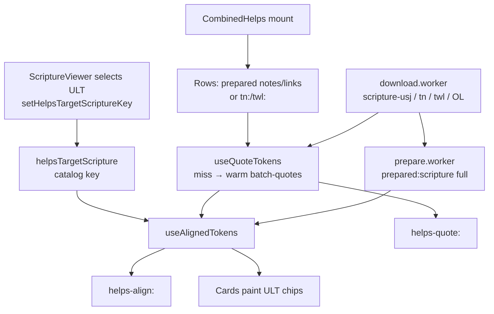
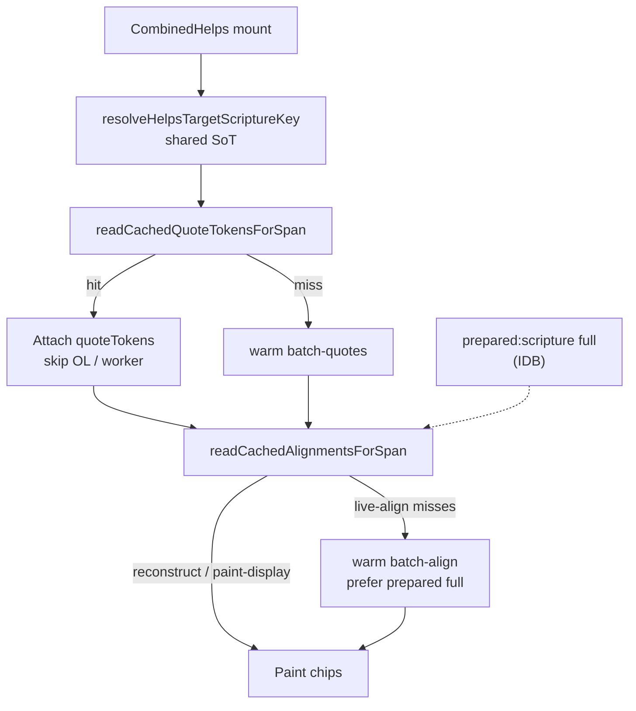

# Helps quote / align flow (tc-study)

How CombinedHelps paints **ULT (target) quote chips** on TN/TWL without waiting for ScriptureViewer to load or publish tokens.

This is the **current intended design** after decoupling chip paint from `SCRIPTURE_TOKENS`. Key names match the code.

**Companions:** [workers-and-persistence.md](./workers-and-persistence.md) (IDB prefixes, workers, lanes) · [app-lifecycle-data-flow.md](./app-lifecycle-data-flow.md) (boot → first paint).

---

## 1. Goal

Show target-language quote chips (usually ULT) on Translation Notes and Translation Words Links as soon as:

1. Helps rows exist (`prepared:notes` / `prepared:words-links`, or loader `tn:` / `twl:`), and
2. OL quote tokens can be built (or cache-hit), and
3. Align can reconstruct or live-align against **prepared scripture full** (or paint stored display texts).

**Not required for chip paint:** ScriptureViewer mount, USJ hydrate in the pane, or a live `SCRIPTURE_TOKENS` broadcast.

`SCRIPTURE_TOKENS` remain optional for **underlines** and as a **live-align fallback** when prepared full is missing and a scripture panel is mounted.

---

## 2. Actors

| Actor | Role |
| --- | --- |
| **CombinedHelps** (`CombinedHelpsViewer`) | Mounts pipeline; resolves target catalog key; feeds warm lane-1 visibility |
| **`useCombinedHelpsPipeline`** | TN + TWL rows → quote → align → merge → underline groups → display |
| **`useQuoteTokens`** | Step 2: OL origWords → `quoteTokens` (cache-first `helps-quote:`) |
| **`useAlignedTokens`** | Step 3: quoteTokens → ULT chips (cache-first `helps-align:` + `prepared:scripture` full) |
| **Cards** (`WordLinkCard`, TN cards) | Paint chips from `alignedTokens` / `quoteStatus`; do not own workers |
| **`helpsTargetScripture`** | Module SoT: shared **catalog key** for target scripture (not tokens) |
| **`warm.worker`** | Preferred live `batch-quotes` / `batch-align`; lanes 2/3 when concurrency ≥ 4 |
| **`prepare.worker`** | Scripture prepare (`prepared:scripture`); live batch fallback if warm Worker fails |
| **`backgroundDownload.worker`** | Zip → SoT only (`scripture-usj:`, `tn:`, `twl:`, OL); never prepares or quotes |
| **`SCRIPTURE_TOKENS`** | Panel broadcast of live tokens; optional for underlines / live-align fallback |
| **`helpsTokenReuse`** | In-memory `Map<linkId, …>` for current book (chapter-nav reuse) |

Support-ref / TWL-article filters reuse the same caches via `useSupportRefQuotes` / `useTwlArticleQuotes` (same key families, book-stream first paint).

---

## 3. Shared identity vs panel broadcast

### What helps takes from the scripture panel

**Catalog key only** — e.g. `unfoldingWord/en/ult`.

Written by ScriptureViewer on resource select (`setHelpsTargetScriptureKey`) and reinforced from `useTokenBroadcast` / token snapshot when tokens publish. Survives:

- Collapsed / unmounted ScriptureViewer
- Passage invalidate that clears the live `SCRIPTURE_TOKENS` hydrate
- Helps-mode switch that leaves no token owner

### Resolve order (`resolveHelpsTargetScriptureKey`)

1. Shared SoT (`getHelpsTargetScriptureKey`)
2. Live broadcast `sourceResourceId`
3. Durable last-known source id (`getLastScriptureTokensSourceResourceId`)
4. First non-OL scripture in the preferred gateway language (`loadedResources`)

Align then loads `prepared:scripture:{targetKey}:…:full` and `helps-align:…:{target}@{stamp}:…` from that key. It does **not** wait for panel ownership or token verse-span hydrate.

### What is *not* shared identity

| Signal | Purpose |
| --- | --- |
| Panel instance id / `lastActiveScriptureResourceId` | Who may **publish** `SCRIPTURE_TOKENS` (single owner) |
| Live token array | Underlines + optional live-align when prepared full absent |
| `pendingHelpsHighlight` | Module memory underline replay — **not** IDB |

---

## 4. End-to-end stages (visible chapter)

Numbered as CombinedHelps experiences them after Read has language + catalog.

| # | Stage | What happens | IDB / memory |
| --- | --- | --- | --- |
| **0** | **Mount** | CombinedHelps + `useWarmLanes({ owner: 'helps' })`. Target key from shared SoT (or fallbacks). `warmVisibleHelpsResources` lists TN/TWL (+ target scripture for lane visibility). | — |
| **1** | **Rows** | Prefer `prepared:notes` / `prepared:words-links` full for the chapter span; else loader `tn:` / `twl:` slices. Filter to BCV / kind / token filters. | `prepared:notes:` · `prepared:words-links:` · `tn:` · `twl:` |
| **2** | **Quote** | `useQuoteTokens`: cache-first `readCachedQuoteTokensForSpan`. Miss → warm.worker `batch-quotes` (prepare.worker fallback). Needs OL USJ (`scripture-usj:` UGNT/UHB). Per-link `quoteReady` unblocks align after pass 1. **Multi-verse TN:** `parseHelpsReference` expands `5:2-3` / `5:1,3,8,12`; listed verses are joined into one stream; each `&` part is the next occurrence left to right. Partial hits are kept. | Write `helps-quote:` |
| **3** | **Align** | `useAlignedTokens`: cache-first `readCachedAlignmentsForSpan`. Prefer reconstruct `{p,m}` against **prepared full** tokens; else **paint-display** from stored `t`; else live-align (prepared full preferred over broadcast). | Read `prepared:scripture:…:full` · write `helps-align:` |
| **4** | **Paint** | Cards show ULT chips from `alignedTokens`. Underlines (`NOTES_TOKEN_GROUPS`) rebind when scripture / tokens become ready — separate from chip paint. | Module highlight map (optional) |

Lane 1 for helps drains when notes are not pending **and** (`quoteReady` **or** quote cache-hit **or** quotes blocked because OL zip is missing). That unlocks warm lanes 2/3 for the rest of the book.

---

## 5. Cache hit vs miss

### Quote (`helps-quote:`)

```
helps-quote:{helps}@{hs}:{ol}@{os}:{book}:{ch}
→ Record<linkId, CachedQuoteToken[]>   // empty array = settled miss
```

- **Hit:** attach tokens; skip OL load / worker for those links.
- **Miss:** live build on warm.worker; `mergeAndWriteCachedQuoteTokens`.
- **While scrolling:** hydrate from IDB only (no worker enqueue). Soft stamp budget on hydrate is long (see §8); live persist ctx is short.

### Align (`helps-align:`)

```
helps-align:{helps}@{hs}:{ol}@{os}:{target}@{ts}:{book}:{ch}
→ Record<linkId, { p: number[]; m: 0|1|2; t?: string[] }>
```

`m`: 0 miss · 1 semantic/zaln · 2 quote-text fallback. Optional `t` = display texts for refresh paint without tokens.

`planAlignCacheHydrate`:

| Plan | Meaning |
| --- | --- |
| `reconstruct` | Hits + full-chapter prepared (or broadcast) tokens → expand `p[]` |
| `paint-display` | Hits with `t` → chips without waiting for tokens |
| `wait-for-tokens` | Full IDB hit, no reconstruct/display yet, no tokens → wait |
| `live-align` | Misses / partial → warm.worker `batch-align` |

Reconstruct **only** against prepared **full** (or equivalent full-chapter flat tokens) — never light tier or raw live USJ chapter blobs as the position base.

### Warm background (lanes 2/3)

After lane 1 drains: `quote-chapter` / `align-chapter` / `prepare-unit` fill the rest of the book into the same key families. Outcomes `blocked` (OL missing) do not mark `warm-coverage:v1`.

---

## 6. When `SCRIPTURE_TOKENS` is still used

| Use | Required for chips? |
| --- | --- |
| Live underlines on the scripture pane (`NOTES_TOKEN_GROUPS` / `scriptureReadyUnderlineRebind`) | No — chips paint first; underlines catch up |
| Live-align **fallback** when prepared full is absent and panel is mounted | Only if prepared path cannot supply tokens |
| Keeping last-known source id / reinforcing shared target key on publish | No — shared SoT is primary |
| Ownership (`isScriptureTokensOwner`) | N/A to chips — prevents multi-writer races |

Chip path: **shared catalog key → prepared full / helps-align cache**. Broadcast is a side channel.

### Multi-verse TN quotes (headers, chips, highlight)

Door43 `Quote` uses `&` for discontinuous OL snippets; `Reference` may be a range (`5:2-3`) or a comma list (`5:1,3,8,12`).

| Surface | Behavior |
| --- | --- |
| **Parse / align** | `parseHelpsReference` expands the listed verses; `buildQuoteTokens` joins those OL tokens into one virtual verse and walks each `&` part as the next occurrence (same as single-verse multi-occurrence). Hits keep real `chapter`/`verse` so ULT zaln paints every source verse. |
| **Chips** | One button, ULT label. Non-contiguous hits join with `…` (same as `“will … sojourn with you”`). Do not show `&`. A partial hit paints what aligned — it does not lock the whole note on OL. |
| **Headers** | CombinedHelps group label is the real ref (`5:1, 3, 8, 12`, `5:2–3`), still icon-first (`BookOpen` + compact numbers + count). |
| **Highlight** | Card click jumps to the **first** hit; `alignedSemanticIds` cover every aligned verse so underlines appear on all hits in the chapter. |
| **Placement** | Same as existing ranges: the note shows when viewing **any listed verse** (not in-between verses of a comma list). |

`helps-quote:` v5 stores optional `chapter`/`verse` on cached tokens and keeps those stamps on align clones. `helps-align:` v6 rebuilds chips so every listed-verse hit paints (`…` between non-contiguous hits). TN TSV parse (`NOTES_TSV_PARSER_VERSION` 2) keeps the raw `Reference` string; prepared notes v4 rebuilds only from current `tn:` blobs.

---

## 7. Collapse / nav / refresh (brief)

| Event | Behavior |
| --- | --- |
| **Collapse / unmount scripture** | Shared target key remains. Align keeps using prepared full + IDB; may `ensurePreparedFullChapter` + `subscribePrepareReady` (`preparedTick`) without tokens. |
| **Chapter nav** | `helpsTokenReuse` keeps per-link quote/align in memory for the **current book**. Scroll unsettled → IDB hydrate only; no live worker thrash. |
| **Book nav** | Memory reuse map clears. Wrong-book token reintroduce is guarded. Fresh quote/align for the new book (cache-first). |
| **Refresh / revisit** | Workers empty; IDB survives. Hydrate `helps-quote:` / `helps-align:` with long stamp budget; paint-display avoids “rebuild” feel when `t` is stored. Warm reseeds from downloaded keys + coverage. |
| **Helps ↔ scripture mode switch** | Token ownership must hand off to a still-mounted scripture (`resolveLastActiveAfterScriptureUnmount`); chips still use shared key + prepared. |

---

## 8. Timeouts / soft budgets / worker preference

| Budget | Value | Meaning |
| --- | --- | --- |
| `HELPS_CACHE_HYDRATE_BUDGET_MS` | 5s | Wait for catalog stamps so warm IDB rows can still be keyed on refresh |
| `HELPS_CACHE_CONTEXT_BUDGET_MS` | 250ms | Miss-path persist ctx only — do not block live build forever on hung stamps |
| Sync tiny batch | `HELPS_SYNC_MAX_LINKS` | Tiny sets may sync on main; chapter-sized must use worker |

**Worker preference (live lane-1):**

1. `batchQuotesOnWarmWorker` / `batchAlignOnWarmWorker` (dedicated warm Worker — even when lanes 2/3 still fold onto prepare on low concurrency).
2. Else `prepare.worker` `batch-quotes` / `batch-align`.
3. Sync only if worker rejects / unavailable, or tiny / gated batches (`settleHelpsWorkerOrSync`, `shouldSyncHelpsAlign`).

Do **not** time out into main-thread chapter builds — that regressed UI jank.

Download badge 100% ≠ quotes ready. Quotes need OL SoT (`ensureOriginalLanguageDownload` if UGNT/UHB missing).

---

## 9. Diagrams

### Happy path (cold, scripture collapsed or still loading)



### Cache hit path (refresh / revisit)



### ASCII (same idea)

```
download.worker → scripture-usj / tn / twl / OL
prepare.worker  → prepared:scripture:{ult}:…:full
                      │
ScriptureViewer ──setHelpsTargetScriptureKey(ult)──► helpsTargetScripture
                      │
CombinedHelps → rows → useQuoteTokens → helps-quote:
                      → useAlignedTokens → helps-align: + chips
                      ↘ SCRIPTURE_TOKENS (optional: underlines / live-align fallback)
```

---

## 10. Key examples

```
# SoT
scripture-usj:unfoldingWord/en/ult:tit:1
scripture-usj:unfoldingWord/el-x-koine/ugnt:tit:1
tn:unfoldingWord/en/tn:tit
twl:unfoldingWord/en/twl:tit

# Prepared target (align reconstruct base)
prepared:scripture:unfoldingWord/en/ult:tit:1:full

# Quote = helps × OL
helps-quote:unfoldingWord/en/tn@v45:unfoldingWord/el-x-koine/ugnt@v1+2.1.0-usj:tit:1

# Align = helps × OL × target
helps-align:unfoldingWord/en/tn@v45:unfoldingWord/el-x-koine/ugnt@v1+2.1.0-usj:unfoldingWord/en/ult@v1+2000210:tit:1
```

Stamps, versions, TTL (30 days on quote/align), and GC: see [workers-and-persistence.md](./workers-and-persistence.md) §§2–6.

---

## File map

| Area | Files |
| --- | --- |
| Shared target SoT | `src/features/helps/helpsTargetScripture.ts` |
| Quote / align hooks | `WordsLinksViewer/hooks/useQuoteTokens.ts`, `useAlignedTokens.ts` |
| Multi-verse refs | `quoteTokens/parseHelpsReference.ts`, `resource-parsers` `NotesProcessor.normalizeReference` |
| Pipeline / cards | `CombinedHelpsViewer/useCombinedHelpsPipeline.ts`, `index.tsx` |
| Caches | `helpsQuoteCache.ts`, `helpsAlignCache.ts`, `alignCacheHydratePlan.ts`, `reconstructAlignFromPositions.ts` |
| Budgets / reuse | `helpsCacheContextBudget.ts`, `helpsTokenReuse.ts` |
| Tokens broadcast | `scriptureTokensStore.ts`, `scriptureTokensBroadcast.ts`, `ScriptureViewer/hooks/useTokenBroadcast.ts` |
| Ownership | `features/messaging/scriptureTokensOwnership.ts` |
| Underlines | `scriptureReadyUnderlineRebind.ts`, `helpsCardScriptureNav.ts` |
| Workers | `warmClient.ts` (`batchQuotesOnWarmWorker` / `batchAlignOnWarmWorker`), `prepareClient.ts`, `warm.worker.ts`, `prepare.worker.ts` |
| Warm visibility | `warmVisibleHelpsResources.ts`, `useWarmLanes.ts` |
