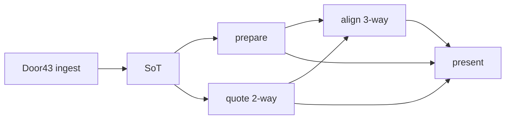

# Recreate readers + workers (porting map)

What another team needs in order to rebuild **scripture / helps readers and the ingest → warm pipeline** in Kotlin, Swift, Rust, or any UI — **without** cloning React, LinkedPanels, or tc-study chrome.

This is a **map**, not a second copy of every algorithm. Payloads and version gates live in [cache-data-structure.md](./cache-data-structure.md). Quote → chip behavior lives in [helps-quote-flow.md](./helps-quote-flow.md). Job kinds and lanes live in [workers-and-persistence.md](./workers-and-persistence.md). Boot order of *this* Vite/React app lives in [app-lifecycle-data-flow.md](./app-lifecycle-data-flow.md) and is **not** a port requirement.

**Do not invent APIs.** Names below are the current TypeScript modules. A port implements the same **contracts** (keys, envelopes, match rules, job outcomes). Storage can be SQLite, files, or anything else; UI can be anything.

---

## 1. Goal

A new implementation can:

1. Ingest a Door43 release (zip or per-file) into a **source of truth**.
2. Mark completeness with receipts (`absentFromRelease`, `ingestSchema`, stamps).
3. Prepare scripture / helps units (light / full / nav).
4. Build **2-way quotes** (helps × UGNT/UHB) and **3-way align** (helps × OL × target).
5. Present scripture + TN/TWL chips from those artifacts.

It does **not** need: CombinedHelps, NavigationBar, LinkedPanels, icon-first chrome, process debug, workspace packages, or this app’s React hook graph.

---

## 2. What already exists

| Doc | Portable? | Use it for |
| --- | --- | --- |
| [cache-data-structure.md](./cache-data-structure.md) | **Yes — primary** | DBs vs key families, SoT vs artifacts, envelopes, version table, language-pack *contents* (not an implemented zip format) |
| [helps-quote-flow.md](./helps-quote-flow.md) | **Mostly** (strip CombinedHelps / `SCRIPTURE_TOKENS`) | Quote → align stages, `m` codes, multi-verse `&`, cache hit vs miss |
| [workers-and-persistence.md](./workers-and-persistence.md) | **Jobs / lanes yes**; Web Worker + badge no | Job kinds, `blocked`/`cached`/`finished`/`noop`, lane admission, OL required |
| [app-lifecycle-data-flow.md](./app-lifecycle-data-flow.md) | **This app only** | Vite boot, CatalogProvider, Read hydrate — do not port |
| [FRAMEWORK_GUIDE.md](./FRAMEWORK_GUIDE.md), [extending-registries.md](./extending-registries.md) | This app / React plugins | Building another *BT Synergy* web app |
| [RENDERING_BIBLE_AND_ALIGNED_BIBLE.md](./RENDERING_BIBLE_AND_ALIGNED_BIBLE.md) | This app | `scriptureResourceType` + ScriptureViewer |
| `apps/tc-study/TWL_ALIGNMENT_SYSTEM.md` | **Stale overview** | Historical three-layer story. Live merge-then-count `&` and zaln attach are the source files in §6, not that doc’s STEP 2 |
| [CACHE_COMPLETENESS_TRACKING.md](./CACHE_COMPLETENESS_TRACKING.md) | **Partly obsolete** | Receipt idea is real; `window.__catalogManager__` / hook names are historical |
| [CHAPTER_VERSE_MAP.md](./CHAPTER_VERSE_MAP.md) | Historical metadata | Not the current `scripture-usj:` chapter SoT |
| [DYNAMIC_PANELS_ARCHITECTURE.md](./DYNAMIC_PANELS_ARCHITECTURE.md) | This app | Panel grid |

**Version authority:** [cache-data-structure.md](./cache-data-structure.md) §4 (`HELPS_QUOTE_VERSION` **5**, `HELPS_ALIGN_VERSION` **6**, `SCRIPTURE_PREPARE_SCHEMA` **3** → combined **`3000220`** for `2.2.0-usj`). Companion docs still show older digits in places — follow the cache doc + `resourceArtifactRecipe.ts`.

---

## 3. Layers (portable pipeline)

### Door43 ingest

Catalog metadata is **not** content. Resource keys are `{owner}/{language}/{id}`. Stamps: `release.tag_name` + `published_at`, else `version`, else `nostamp` (sanitize `:` `|` `@` → `_`). Ingredients are downloadable units (usually books).

Loaders fetch a **zipball** or remaining **per-file** ingredients, parse USFM/TSV/MD, write SoT, then write a `resource:{key}` receipt. Download **must not** prepare, quote, or align.

Shared policy: `packages/resource-catalog/src/ingredientFetchPolicy.ts` (`chooseIngredientFetchMode`).

| Cached present | Remaining in release | Mode |
| --- | --- | --- |
| 0 | > 0 | `zip` |
| ≥ 1 (`PARTIAL_CACHE_INDIVIDUAL_MIN_CACHED`) | > 0 | `individual` |
| any | 0 | `skip` |

“Remaining” excludes catalog phantoms (`num`, `frt`, …) listed on the receipt as `absentFromRelease`. Completeness walks use **present** count (`presentIngredientCount`), not raw ingredient length.

**OL is a quote dependency, not a gateway completeness item.** NT → `unfoldingWord/el-x-koine/ugnt`, OT → `unfoldingWord/hbo/uhb` (`resolveOriginalLanguageKey`). OBS has no OL key.

### SoT

Rebuildable only from Door43 (or a language pack that includes these keys). See cache-data-structure §2–3.

| Kind | Prefix / key | Grain |
| --- | --- | --- |
| Scripture | `scripture-usj:{key}:{book}:{ch}` + thin book index | chapter |
| TN / TQ | `tn:` / `tq:` `{key}:{book}` | book (adapter may chunk chapters) |
| TWL | `twl:{key}:{book}` | book (one row) |
| OBS | `obs:{key}:{story}` | story `01..50` |
| TA / TW | `{key}/{entryId}` | article |
| Receipt | `resource:{key}` | resource |

Recipes: `apps/tc-study/src/config/resourceArtifactRecipe.ts`. TN/TWL declare `quotes` + `align` and `needs: ['ol-by-book']`. Scripture / TQ / OBS / TA / TW are prepare-only.

### Prepare

CPU against **local SoT**. Writes `prepared:{type}:{key}:{book}:nav` and `{unit}:{light|full}`. Scripture **full** is the only legal reconstruct base for align `p[]` — never light, never raw live USJ.

`scripturePreparer.ts` is already React-free. Light drops token identity; full keeps `matchKeys` + `{ c, o, k, a }`. Schema bump × USJ digits → `SCRIPTURE_PREPARE_VERSION`.

### Quote (2-way)

Helps row (`origWords` / `quote` + `occurrence` + `Reference`) × OL USJ tokens → `helps-quote:{helps}@{hs}:{ol}@{os}:{book}:{ch}` = `Record<linkId, token[]>`. Empty array = settled miss. TTL 30 days. Version **5** (tokens may carry `chapter` / `verse`).

### Align (3-way)

Quote tokens × **prepared full** target → `helps-align:…:{target}@{ts}:…` = `Record<linkId, { p, m, t? }>`. `m`: 0 miss, 1 semantic/zaln, 2 quote-text fallback. One row **per target**. Reconstruct `p[]` against that chapter’s full token array; `t[]` paints chips before tokens exist.

### Present

Any UI that can:

- Paint scripture from prepared light/full (or SoT USJ).
- List TN/TWL rows for a BCV span.
- Paint chips from align `t[]` or reconstructed `p[]`.
- Optionally underline scripture from semantic ids.

How panels share a “target scripture catalog key” is an app choice. tc-study uses `helpsTargetScripture` + optional `SCRIPTURE_TOKENS`; a port can pass the target key explicitly.

---

## 4. Portable contracts vs this-app UI

| Layer | Portable (must exist in a port) | This app only |
| --- | --- | --- |
| Identity | `{owner}/{lang}/{id}`, book codes, BCV, OL UGNT/UHB | Workspace `{lang}_tc-helps`, panel ids |
| Catalog | Metadata + ingredients + release stamp | Door43 search UX, Add-to-catalog wizard |
| Ingest | Zip vs individual, receipts, `absentFromRelease` | Download badge, `DownloadIndicator` |
| SoT | Prefixes, chapter USJ + `alignmentMap` | IndexedDB adapter chunking, `BOOK_ORGANIZED_PREFIXES` |
| Prepare | light/full/nav shapes + version formula | `prepare.worker` / `enqueueScriptureBookPriority` |
| Quote / align | Matcher, `&` walk, zaln attach, `m`/`p`/`t` | CombinedHelps cards, `useQuoteTokens` hooks |
| Jobs | Kinds, skip-if-exists, `blocked` if OL missing | Web Workers, `hardwareConcurrency >= 4`, React remount singletons |
| Warm | Visible-first then rest-of-book then canon | Lane-1 owners `scripture`/`helps`, `window.__warmDebug` |
| Chrome | — | LinkedPanels, NavigationBar, icon-first, process debug, theme LS |
| Session | — | `tc-study:read-panels`, `bt-synergy:navigation-state`, collections DB |

Storage names (`tc-study-cache`, IndexedDB) are **this deployment**. A port needs the **key families and envelopes**, not IDB.

---

## 5. Checklist — specify independently of React

A recreation spec is complete only when each item has **rules + fixtures**, not just “see the hook.”

### Ingest and completeness

- [ ] Resource key + stamp sanitization (cache-data-structure §3).
- [ ] Zip vs per-file vs skip — `chooseIngredientFetchMode` (`ingredientFetchPolicy.ts`). Threshold is **1** cached present ingredient.
- [ ] Catalog-vs-git phantoms — `absentFromRelease` (`releaseIngredientPresence.ts`). Completeness excludes them; `ingredientCount` is present count.
- [ ] Receipt fields: `downloadComplete`, `releaseStamp`, `ingestSchema` (`usj:{USJ_PROCESSING_VERSION}` / `helps:1`), `downloadMethod`, `absentFromRelease`.
- [ ] Matching receipt skips zip **and** ingredient walks; stamp or USJ schema bump invalidates; legacy unstamped `downloadComplete` still walks once.
- [ ] OL download is separate from gateway 100% (`ensureOriginalLanguageDownload` behavior: if UGNT/UHB SoT missing, quote/align return `blocked`).

### SoT and prepare

- [ ] Chapter-grained `scripture-usj:` (`usj` + `alignmentMap` + one `chapters[]` slice; book key = `{ chapterNumbers }`).
- [ ] `tn:` / `twl:` / `tq:` / `obs:` / article keys (cache-data-structure §3). TWL is **not** adapter-chunked.
- [ ] Recipes: which types need `ol-by-book` (`resourceArtifactRecipe.ts`).
- [ ] Prepare tiers: nav / light / full; scripture full token identity (`scripturePreparer.ts`).
- [ ] Version formula: `SCRIPTURE_PREPARE_SCHEMA * 1_000_000 + USJ digits`.

### Quote

- [ ] `parseHelpsReference` — `5:2-3`, `5:1,3,8,12`, `5:1-2,8`, `1:intro`, `5:front` / `5:0` (`parseHelpsReference.ts`).
- [ ] TN TSV keeps **raw** `Reference`; `NotesProcessor.normalizeReference` only collapses `front` / `intro` (`notes-parser.ts`, `NOTES_TSV_PARSER_VERSION` `2`).
- [ ] `splitHelpsQuote` on `&` (whitespace-tolerant).
- [ ] **Merge-then-count:** join listed-verse OL tokens into one stream; each `&` part is the **next** occurrence left-to-right; first part uses TSV `occurrence`, later parts use `1`; **partial hits are kept** (`buildQuoteTokens.ts`). Do not map part *i* to verse *i*.
- [ ] `QuoteMatcher.findOriginalTokens` — Hebrew/Greek folds, occurrence walk (`quote-matcher.ts`). `buildQuoteTokens` feeds it a **virtual one-verse** stream after merge (so matcher `&` split is not the multi-verse policy).
- [ ] Semantic ids: `{book} {ch}:{vs}:{surface}:{occurrence}` — **inflected** `x-content` / token text, not lemma (`generateSemanticIds.ts`, `semanticIdFor`).

### Align and zaln

- [ ] Harvest `\zaln` into `alignmentMap`; **pre-verse / Psalm `\d`** groups attach to verse 1 (`preVerseAlignments.ts`, `attachAlignmentSemanticIds.ts`).
- [ ] Target match: token `alignedOriginalWordIds` or own `semanticId` (`findAlignedTokens.ts`).
- [ ] Quote-text fallback (`m = 2`) only when helps language = text language **or** the pane is OL (`resolveAlignedQuoteTokens.ts`). No TM aligner.
- [ ] Persist `{ p, m, t? }`; reconstruct only against prepared **full** (`reconstructAlignFromPositions.ts`). Hebrew U+2060 word-joiner on UHB must still hit ULT zaln without the joiner (`batchAlignLinks.test.ts`).

### Jobs / lanes (platform-neutral)

- [ ] Three **roles**, not three browser Workers: ingest (network→SoT), prepare (SoT→prepared), warm (quote/align + background prepare).
- [ ] Job kinds: `prepare-unit`, `quote-chapter`, `align-chapter`, `prepare-article` (`warmTypes.ts`).
- [ ] Outcomes: `finished` / `cached` count toward coverage; `blocked` (OL missing) and `noop` do **not**.
- [ ] Visible chapter first; rest of book; then canon. Download-complete ≠ quotes ready.
- [ ] Closing the process drops in-flight work; SoT + artifacts persist.

---

## 6. What can stay “this app only”

Do **not** specify these as port requirements:

- LinkedPanels / panel grid / `DYNAMIC_PANELS_ARCHITECTURE.md`
- CombinedHelps chrome (kind filter, sources menu, sticky bar, icon-first headers)
- NavigationBar, language picker grid, catalog wizard, collection import/export UI
- Process debug host / `window.__warmDebug` / console log prefixes
- `SCRIPTURE_TOKENS` broadcast, token-owner handoff, `pendingHelpsHighlight` module memory
- React hooks (`useQuoteTokens`, `useWarmLanes`, CatalogProvider boot)
- localStorage chrome (`tc-study:read-panels`, theme, workspace)
- `tc-study-collections` packages (workspace, not content)
- Existing **collection** zip (`CollectionExportService`) — it is **not** a language pack (can miss stamped quote/align keys and OL)

A port still needs *some* way to pick language, book, chapter, and target scripture. That UX is free.

---

## 7. Gap list — not fully specified as portable algorithms

Existing docs describe **keys, stages, and outcomes**. They do not replace the matchers. Port from these files (plus their tests); do not invent a new matcher.

| Contract | Doc coverage today | Source of truth |
| --- | --- | --- |
| Hebrew / Greek quote fold + occurrence walk | Comments in matcher; TWL_ALIGNMENT_SYSTEM is outdated | `packages/resource-parsers/src/utils/quote-matcher.ts` + `quote-matcher.test.ts` |
| Merge-then-count `&` across listed verses | helps-quote-flow §6 (behavior) | `apps/tc-study/src/features/helps/quoteTokens/buildQuoteTokens.ts` + `buildQuoteTokens.test.ts` |
| Reference parse (range / list / intro / front) | helps-quote-flow §6 | `quoteTokens/parseHelpsReference.ts` + `.test.ts` |
| TN TSV raw `Reference` | cache-data-structure (version only) | `packages/resource-parsers/src/parsers/tsv/notes-parser.ts` |
| zaln → `alignmentMap` + pre-verse `\d` | Implied by USJ SoT | `packages/usj-processor/src/{usfmTools,preVerseAlignments,attachAlignmentSemanticIds}.ts` + `psa14-superscription.test.ts` |
| USFM → chapter USJ + tool versions | Version table only | `packages/usj-processor/src/USJProcessor.ts`, `packages/scripture-loader/src/usjChapterStore.ts` |
| Scripture full token / `matchKeys` / `{c,o,k,a}` | Abbreviated JSON example | `apps/tc-study/src/features/scripture/scripturePreparer.ts` |
| Notes / TWL / TQ prepare row shape | Versions only | `features/notes/notesPreparer.ts`, `wordsLinks/wordsLinksPreparer.ts`, `questions/questionsPreparer.ts` |
| zaln attach + `m` / reconstruct | helps-quote-flow §5 | `findAlignedTokens.ts`, `resolveAlignedQuoteTokens.ts`, `reconstructAlignFromPositions.ts` |
| Zip vs individual | Mentioned, not specified | `packages/resource-catalog/src/ingredientFetchPolicy.ts`; loaders apply it |
| Completeness walk + receipt merge | CACHE_COMPLETENESS stale; cache-data-structure receipt JSON | `packages/resource-catalog/src/releaseIngredientPresence.ts`, `apps/tc-study/src/lib/services/ResourceCompletenessChecker.ts` |
| OL book → UGNT/UHB | One-liner in workers doc | `apps/tc-study/src/features/helps/olLoadCache.ts` (`NT_BOOKS`) |
| Lane admit numbers (8 / 32 / 750 ms / tab visible) | workers-and-persistence §4 | `features/warm/warmAdmitPlan.ts`, `warmLanePolicy.ts` — **policy**, not correctness |
| OBS frame quotes | Not in the four core docs | `apps/tc-study/src/lib/obs/buildObsFrameQuotes.ts` |
| Language-pack zip on the wire | cache-data-structure §6 (should-include list) | **Not implemented.** Collection export is a different format |
| Semantic-id match fold | — | `apps/tc-study/src/features/helps/semanticIdMatchKey.ts` |

**Intentionally out of scope for a first port:** TA/TW article HTML, collection sharing, catalog reactive download UX, e2e deploy parity.

---

## 8. Suggested doc phases + effort

Estimates are **documentation + golden fixtures**, not writing a Kotlin/Swift app.

| Phase | Deliverable | Effort | Depends on |
| --- | --- | --- | --- |
| **0 — this map** | Portable vs app-only; pointers | Done | — |
| **1 — quote/align spec** | Language-agnostic rules + fixtures: parse, merge-then-count `&`, folds, semantic ids, `m`/`p`/`t`. Extract from §7 files; retire TWL_ALIGNMENT_SYSTEM as authority | **1–2 weeks** | Phase 0 |
| **2 — USJ + zaln + prepare** | USFM→chapter SoT; pre-verse zaln; full-token identity; Psalm `\d` fixture | **1–2 weeks** | Phase 1 (ids must match) |
| **3 — ingest receipts** | Zip/individual/skip; `absentFromRelease`; stamp/schema invalidation as a one-pager + table-driven tests | **3–5 days** | cache-data-structure |
| **4 — job contract** | Platform-neutral job/outcome/coverage spec (no `postMessage`). Lane numbers as *recommended scheduler*, not matcher correctness | **2–4 days** | workers-and-persistence |
| **5 — interchange** | Optional language-pack manifest (catalog + receipts + SoT [+ artifacts]). Do not reuse collection export | **~1 week** | Phases 2–3 |
| **6 — OBS (optional)** | Story SoT + frame quotes | **3–5 days** | Phase 1 |

**To hand another team a recreate-able spec:** Phases **1–4** ≈ **3–5 weeks**. Add Phase 5 if they must ship offline packs without Door43.

**To actually port readers + workers:** months, dominated by USFM/USJ + QuoteMatcher parity — not by UI. Keep the React app as the **oracle**: same fixtures should match `helps-quote:` / `helps-align:` / `prepared:scripture` full.

Recommended fixture set (already partly in tests): Titus 1:1 `Παῦλος`; multi-verse TN `5:1,3,8,12` + `A & B & C & D`; Hebrew word-joiner; Psalm 14 `\d` zaln on body v1; phantom `frt`/`num` receipt.

---

## 9. File map (quick)

| Contract | Files |
| --- | --- |
| Recipes | `apps/tc-study/src/config/resourceArtifactRecipe.ts` |
| SoT IO | `apps/tc-study/src/features/sot/{getSoT,fetchDcsSoT,sotCacheKey}.ts` |
| Zip / phantoms | `packages/resource-catalog/src/{ingredientFetchPolicy,releaseIngredientPresence,ingestReceipt}.ts` |
| USJ SoT | `packages/usj-processor/src/*`, `packages/scripture-loader/src/usjChapterStore.ts` |
| Prepare | `features/scripture/scripturePreparer.ts`, `features/notes/notesPreparer.ts`, `features/prepare/*` |
| Quote | `packages/resource-parsers/src/utils/quote-matcher.ts`, `features/helps/quoteTokens/{parseHelpsReference,buildQuoteTokens,generateSemanticIds}.ts` |
| Align | `features/helps/{findAlignedTokens,resolveAlignedQuoteTokens,reconstructAlignFromPositions,helpsAlignCache}.ts` |
| OL key | `features/helps/olLoadCache.ts` |
| Jobs | `features/warm/{warmTypes,warmJobs,warmAdmitPlan}.ts` |
| Ingest worker (this app) | `src/workers/backgroundDownload.worker.ts` |

Companion docs: [cache-data-structure.md](./cache-data-structure.md) · [helps-quote-flow.md](./helps-quote-flow.md) · [workers-and-persistence.md](./workers-and-persistence.md).
